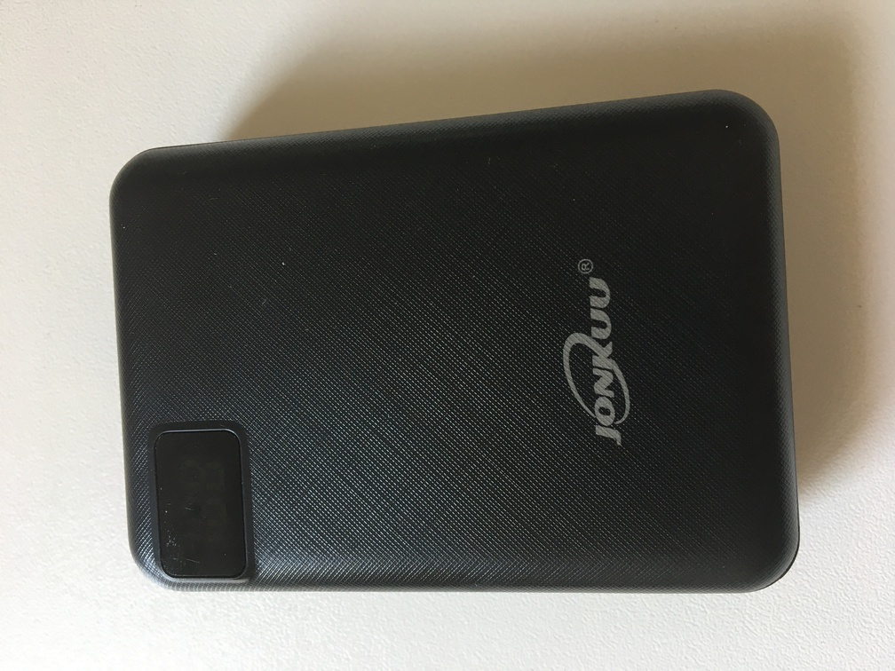
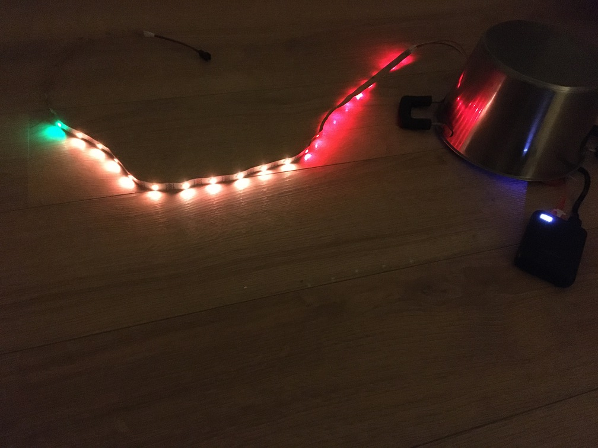

In a previous Devoxx France conference, [Clever-Cloud](https://www.clever-cloud.com/) had a booth where they showed how to use their platform with a small chip that controlled a LED strip, all that communicating through a websocket making the interface with the backend hosted on Clever-Cloud.

This project is on Github : https://github.com/CleverCloud/wemos-statsd-example.

The cool part is that the LED strip and the chip were distributed as goodies :)

I recently found this LED strip in a box, and I wanted to play with it.
On another personal project, I tested a small device, Flower Care, that measures sunlight, soil humidity, temperature, etc.
However I encountered a problem because this device has only Bluetooth LE, and is too far away from my Raspberry Pi to sends its data.

So the idea was to use a Raspberry Pi Zero as a BLE/Wifi relay, and I wanted to see how far I could go in the garden without loosing my Wifi signal.

I'm sure there are apps on smartphone that do exactly that, but it's less fun than playing with a LED strip :)


## Preparation
### Components
The components used are:

#### Chip
It is a Wemos D1 mini board, based on an ESP8266 module.
More details on the constructor website: https://www.wemos.cc/en/latest/d1/d1_mini.html.

We can buy this board for less than 5€ on well-known websites (beware of shipping costs however).

This board includes a Wifi chipset that we will use to detect signal strength.

**Recto**


**Verso**


#### LED strip
I have not a lot of information on this LED strip, but we can see that the brand is 3M, maybe *200 MP* model?

There are 30 LEDs on this strip.


#### Battery
The board needs a standard voltage of 3.3 V or via micro-usb (5V).

When the board is not connected to the computer, I will use a classical external battery.



#### Final assembly
The final assemble looks like that:


### Software
The code will be some C, not very long.

The easiest way to communicate with the board is to use Arduino IDE.
First of all, we must configure the board on the IDE.
This documentation describes the different steps: https://arduino-esp8266.readthedocs.io/en/latest/installing.html.

Main steps are:
- go to *Preferences* and set the *Additional Boards Manager URLs* to http://arduino.esp8266.com/stable/package_esp8266com_index.json
- go to *Tools > Board [...] > Board Manager* and install the `esp8266` board, that would give us access to the Wifi library

I then used these settings:


Finally, to communicate with the LED strip, we must install (with the library manager) the `Adafruit_NeoPixel` library, whose Github project is here: https://github.com/adafruit/Adafruit_NeoPixel.

> **Note** : It is also possible to use VS Code to code and communicate with the board 😎! 
> As a pre-requisite, we must have installed the Arduino IDE (or CLI).
> I then used the following extensions:
> - [Arduino](https://marketplace.visualstudio.com/items?itemName=vsciot-vscode.vscode-arduino)
> - [C/C++](https://marketplace.visualstudio.com/items?itemName=ms-vscode.cpptools)
>
> Then open the Arduino Board Manager (⌘⇧P) and select *Arduino: Board Manager*.
> Select then *LOLIN(WEMOS) D1 R2 & mini*.
> At the bottom right of VS Code, click on *serial port* to select the right USB port.
>
> To verify that the code compiles successfully: ⌥⌘R.
>
> To send the sketch on the board: ⌥⌘U.
>
> 


## Code

Following documentations were useful:

- Wifi module : https://arduino-esp8266.readthedocs.io/en/latest/esp8266wifi/readme.html
- LED strip : https://adafruit.github.io/Adafruit_NeoPixel/html/class_adafruit___neo_pixel.html

Moreover, we can test the code with the LED strip online on this site: https://wokwi.com/arduino/libraries/Adafruit_NeoPixel !!!

The code itself is pretty straightforward:

```C
#include <Adafruit_NeoPixel.h>
#include <ESP8266WiFi.h>

#define LED_PIN D4
#define LED_COUNT 30

#define SCAN_DELAY 500

// See https://fr.wikipedia.org/wiki/Received_Signal_Strength_Indication
#define RSSI_BEST -30
#define RSSI_WORST -90

#define WIFI_SSID "SSID  du réseau à analyser"

Adafruit_NeoPixel strip(LED_COUNT, LED_PIN, NEO_GRB + NEO_KHZ800);
WiFiClient client;
int step;

void setup()
{

    step = (RSSI_BEST - RSSI_WORST) / LED_COUNT;

    Serial.begin(9600);
    Serial.print(F("\nWifi Scan Example"));

    strip.begin();
    strip.setBrightness(20);

    WiFi.mode(WIFI_STA);
    WiFi.scanDelete();
    WiFi.disconnect();

    delay(100);
}

void loop()
{
    String ssid;
    int32_t rssi;
    uint8_t encryptionType;
    uint8_t *bssid;
    int32_t channel;
    bool hidden;
    bool found = false;

    Serial.println(F("Starting WiFi scan..."));
    int numberOfNetworks = WiFi.scanNetworks(/*async=*/false, /*hidden=*/true);

    if (numberOfNetworks > 0)
    {
        Serial.printf(PSTR("%d networks found:\n"), numberOfNetworks);

        for (int i = 0; i < numberOfNetworks; i++)
        {
            WiFi.getNetworkInfo(i, ssid, encryptionType, rssi, bssid, channel, hidden);
            Serial.printf(PSTR("Network %d: name=%s\n"), i, ssid.c_str());
            if (ssid == WIFI_SSID)
            {
                found = true;
                break;
            }
        }
    }

    if (found)
    {
        int numberOfLeds = LED_COUNT - (RSSI_BEST - rssi) / step;
        Serial.printf(PSTR("Found our network %s with rssi %d\n"), WIFI_SSID, rssi);

        for (int j = 0; j < LED_COUNT; j++)
        {
            if (j < numberOfLeds)
            {
                if (j < LED_COUNT / 3)
                {
                    strip.setPixelColor(j, strip.Color(255, 0, 0));
                }
                else if (j < 2 * LED_COUNT / 3)
                {
                    strip.setPixelColor(j, strip.Color(255, 127, 0));
                }
                else
                {
                    strip.setPixelColor(j, strip.Color(0, 255, 0));
                }
            }
            else
            {
                strip.setPixelColor(j, strip.Color(0, 0, 0));
            }
        }
    }
    else
    {
        for (int j = 0; j < LED_COUNT; j++)
        {
            if (j % 2 == 0)
            {
                strip.setPixelColor(j, strip.Color(0, 0, 60));
            }
            else
            {
                strip.setPixelColor(j, strip.Color(0, 0, 200));
            }
        }
    }

    strip.show();

    // Wait a bit before scanning again
    delay(SCAN_DELAY);
}
```

- `LED_COUNT` is the number of LEDs on the LED strip

- To compute the signal strength, we have the RSSI value (*Received Signal Strength Indication*) that is just an indication, and not a precise and absolute value.
  On the [french Wikipedia page for RSSI](https://fr.wikipedia.org/wiki/Received_Signal_Strength_Indication) we learn that, for Wifi, -30 dBm is high, and -90 dBm is the signal reception limit.

- `WIFI_SSID` is the name of the Wifi network we want to scan.

- The code starts with a scan of available wifi networks:
  ```C
  int numberOfNetworks = WiFi.scanNetworks(/*async=*/false, /*hidden=*/true);
  ```

- Then iterates over the networks until it finds the one matching the desired SSID:
  ```C
  for (int i = 0; i < numberOfNetworks; i++)
  {
      WiFi.getNetworkInfo(i, ssid, encryptionType, rssi, bssid, channel, hidden);
      if (ssid == WIFI_SSID)
      {
        found = true;
        break;
      }
  }
  ```
  It also retrieves the signal strength in the `rssi` variable.

- We compute the number of LEDs that we will lit according on the strength of the signal: few LEDs if signal strength is weak, more if it is strong:
  ```C
  int numberOfLeds = LED_COUNT - (RSSI_BEST - rssi) / step;
  ```
  Rest of code is to use different colors.

- If no signal is detected, then every other LED is lit in intense or weak blue.

- Finally, we wait half a second and start the whole process again.


## Demo time !

Being next to the box, the signal is strong!


A bit farther, and with an pan on the head, the signal is weaker:



Finally, without signal (I cheated a little, I changed the SSID to a one that does not exist 😅):


## Conclusion
Playing with electronic components is fun!

Even if I have not coded in C since ... phew ... it is really nice to see a physical object react to its environment according to what we have programmed (even if here, it is very *very* humble).

## Credits
Article photo author is [cottonbro](https://www.pexels.com/@cottonbro) from Pexels site.

https://www.pexels.com/photo/wood-city-street-banner-5599613/
