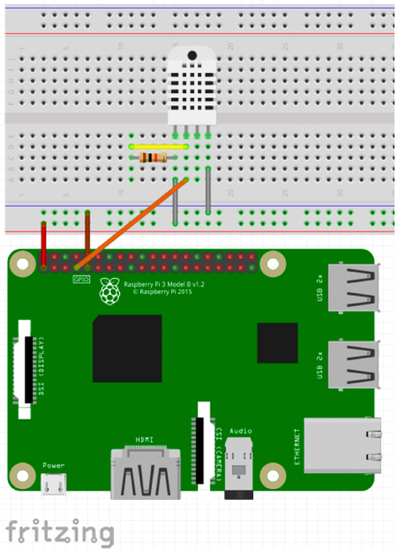
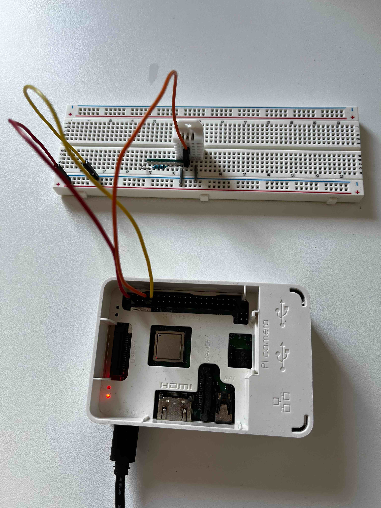
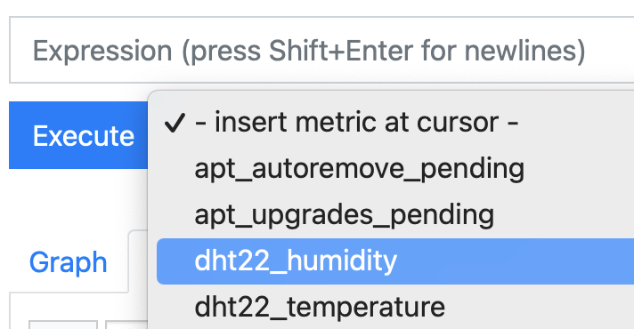
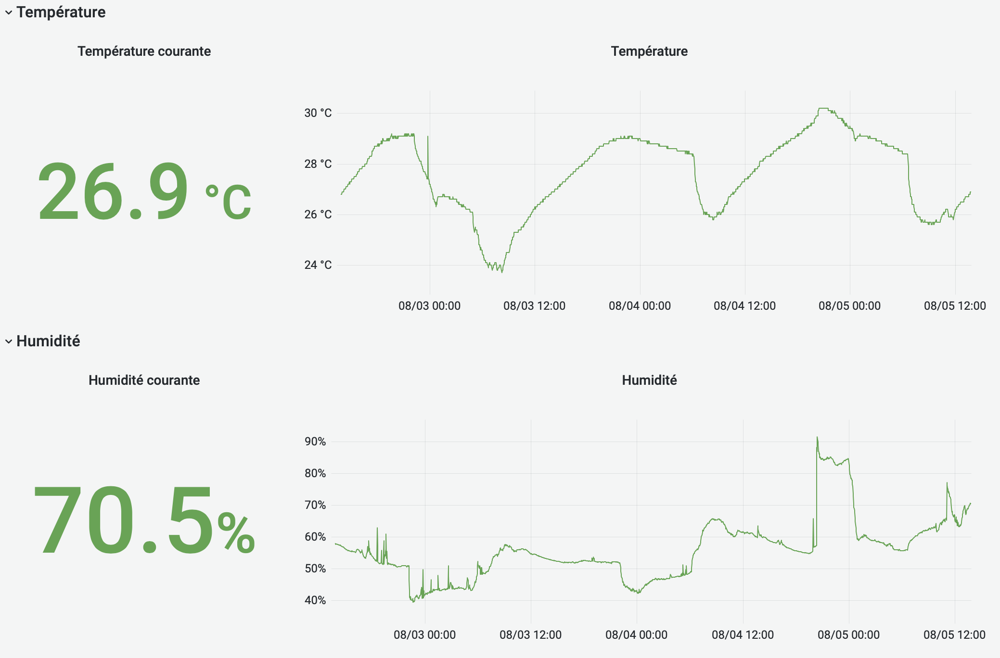

DHT22 is a small temperature and humidity sensor, easy to use.
We can use a Raspberry Pi to communicate with it, and make graphs of temperature and humidity evolution.

## Material
We need:
- a Raspberry Pi (here the 3B+ version)
- a good quality SD card (class 10)
- a power supply for the Raspberry (5V between 2.5A and 3A)
- the DHT22 sensor
- a 10 kΩ resistor
- a breadboard
- another computer to connect to the RPi using SSH
- an RJ45 cable

## RPi installation
### SD card preparation
The easiest way to install the RPi OS is to use the _[Raspberry Pi Imager](https://www.raspberrypi.com/software/)_ software, which allows you to choose the right version of the OS, download it and install it on the SD card.

If you don't want to install this software, you can get the image corresponding to the right version of the RPi here: https://www.raspberrypi.com/software/operating-systems/.
In that cas, you will have to extract the image, then flash it on the SD with a tool like [Etcher](https://www.balena.io/etcher/), or using command line for the most experienced.

Once the OS is installed on the SD card, we will create two special files in the `boot` partition:
- an empty `ssh` file to enable the SSH server
- a `userconf` file containing the password for the `pi` user (because [there is no more default password](https://www.raspberrypi.com/news/raspberry-pi-bullseye-update-april-2022/))

The `userconf` file must contain the new hashed password for the `pi` user.
It can be created this way:

```shell
# Go in the boot partition, adjust according to your OS
cd /Volumes/boot

# Create the file
(echo -n 'pi:'; echo 'changeme' | openssl passwd -6 -stdin) > userconf
```

We can then insert the SD card in the RPi, connect the RJ45 cable between the Rpi and the internet box (or router), and start it by connecting it to the power supply.

### First boot of RPi
When the RPi boots, the internet box or the router gives it an IP address.

> **Note**: it is the DHCP protocol that gives an IP address to the device, it is in general active on most internet boxes.

We don't know its IP address yet, but we can retrieve it in at least two ways.

- **Using the internet box admin panel**  
With a Freebox, go to http://mafreebox.freebox.fr/, then _Périphériques réseau_, right-click on "raspberry pi" > _Propriétés_ then _Connectivité_ tab.
We can then see the last IP address.
We can also see it in the DHCP parameters of the Freebox et view active leases.

- **With `nmap`**  
First, we must know on which network the RPi and the computer are connected to.
So, get the IP address of the computer:
  ```shell
  # Windows: Control panel > Network and share, or open a console and type:
  ipconfig
  
  # Linux
  hostname -I
  
  # Mac : System Preferences > Network
  ```
  If the address is like 192.168.0.78, the type this command (see [this page](https://nmap.org/download) to install nmap):
  ```shell
  sudo nmap -sP 192.168.0.0/24
  ```

  The result is like:

  ```
  Starting Nmap 7.92 ( https://nmap.org ) at 2022-07-29 18:02 CEST
  Nmap scan report for 192.168.0.20
  Host is up (0.19s latency).
  MAC Address: E8:A0:CD:B8:14:8D (Nintendo)
  [...]
  Nmap scan report for 192.168.0.67
  Host is up (0.19s latency).
  MAC Address: B8:27:EB:C8:C4:EE (Raspberry Pi Foundation)
  Nmap scan report for 192.168.0.254
  Host is up (0.074s latency).
  MAC Address: 14:0C:76:A5:00:8E (Freebox SAS)
  Nmap scan report for 192.168.0.55
  Host is up.
  Nmap done: 256 IP addresses (8 hosts up) scanned in 7.22 seconds
  ```

  We can find the RPi IP address, here 192.168.0.67.

### Connect to the RPi using SSH
Now that we know its IP address, we can connect to it using SSH (answer `yes` to the question _"Are you sure you want to continue connecting"_ that will be asked only at the first connexion):

```shell
❯ ssh pi@192.168.0.67
The authenticity of host '192.168.0.67 (192.168.0.67)' can't be established.
ED25519 key fingerprint is SHA256:wL5gzndcDXNkA/Zh8RexfyvFWlyhFYQw2PMvVHhyq20.
This key is not known by any other names
Are you sure you want to continue connecting (yes/no/[fingerprint])? yes
Warning: Permanently added '192.168.0.67' (ED25519) to the list of known hosts.
pi@192.168.0.67's password: 
Linux raspberrypi 5.15.32-v8+ #1538 SMP PREEMPT Thu Mar 31 19:40:39 BST 2022 aarch64

The programs included with the Debian GNU/Linux system are free software;
the exact distribution terms for each program are described in the
individual files in /usr/share/doc/*/copyright.

Debian GNU/Linux comes with ABSOLUTELY NO WARRANTY, to the extent
permitted by applicable law.
Last login: Fri Jul 29 17:07:46 2022 from 192.168.0.67
pi@raspberrypi:~ $ 
```

We are then connected on the RPi.

### Updates, and Wi-Fi configuration
Once connected, we update the system:

```shell
sudo apt update
sudo apt upgrade
```

Wi-Fi configuration is optional, but Wi-Fi will let us put the RPi wherever we want, without any RJ45 cable.
We use the `raspi-config` tool:

```shell
sudo raspi-config
```

Then select:
- `5 Localisation Options`
- `L4 WLAN Country`
- Select the country, e.g. `FR France`
- `Ok`
- `1 System Options`
- `S1 Wireless LAN`
- Set the SSID (_name_) of your Wi-Fi network
- Set the passphrase for Wi-Fi (and then wait a little)
- _Tabulation_ > `Finish`
- Answer `No` to the question `Would you like to reboot now?`

To check that the Wi-Fi network is well configured, type:

```shell
ip a
```

Look for the block corresponding to `wlan0`:

```
3: wlan0: <BROADCAST,MULTICAST,UP,LOWER_UP> mtu 1500 qdisc pfifo_fast state UP group default qlen 1000
    link/ether b8:27:eb:9d:91:bb brd ff:ff:ff:ff:ff:ff
    inet 192.168.0.54/24 brd 192.168.0.255 scope global dynamic noprefixroute wlan0
       valid_lft 43103sec preferred_lft 37703sec
    inet6 2a01:e0a:b15:4890:29a:d0ce:e2aa:4179/64 scope global dynamic mngtmpaddr noprefixroute 
       valid_lft 86303sec preferred_lft 86303sec
    inet6 fe80::ab3e:f91d:ea52:4912/64 scope link 
       valid_lft forever preferred_lft forever
```

Here we can find the IP address of the Wi-Fi card of the RPi:  192.168.0.54.

We can then shut down the RPi (`sudo halt`), unplug RJ45 cable, and restart the RPi by unplugging and replugging the power supply.

If everything goes well, you should be able to connect via SSH on this new IP address.
As it is the first time you connect to this IP from your computer, you will have the same question _"Are you sure you want to continue connecting"_.

````shell
ssh pi@192.168.0.54
````

## Communicate with the sensor
The sensor will be connected to the RPi through its GPIO pins.

We will write a script in Python to retrieve its values.
We will also use a library that will help us communicate with the sensor.

### Add software
Python is already installed on the RPi, so we will just install the [Adafruit CircuitPython DHT](https://github.com/adafruit/Adafruit_CircuitPython_DHT) library to communicate with the sensor.
To do this, connect via SSH to the RPi, and type these commands:

```shell
# Install dependencies
sudo apt -y install python3-pip python3-venv libgpiod2

# Create a dedicated directory
mkdir dht22
cd dht22

# Create a Python virtual environment
python -m venv .venv
source .venv/bin/activate

# Install the "Adafruit CircuitPython DHT" library to communicate with the sensor
pip install adafruit-circuitpython-dht
```

### Connections

The DHT22 sensor has 4 pins, which correspond to:

| PIN | Description      |
| --- | ---------------- |
| 1   | VCC (3.3V to 6V) |
| 2   | Data             |
| 3   | Not used         |
| 4   | Ground           |

We also need a 10 kΩ resistor between pins 1 (VCC) and 2 (Data).

We can find this information [on the Adafruit website](https://learn.adafruit.com/dht/connecting-to-a-dhtxx-sensor) or [on the sensor datasheet](https://www.sparkfun.com/datasheets/Sensors/Temperature/DHT22.pdf).

On the RPi 3B+, the arrangement of the GPIO pins is described on the ([Raspberry PI website](https://datasheets.raspberrypi.com/rpi3/raspberry-pi-3-b-plus-reduced-schematics.pdf)) :


We will use:
- pin 1 (3V3) for current
- pin 7 (GPIO4) to receive data
- pin 9 (GND) for ground

And so we have this schema:



The actual set-up is as follows:



### First test
We first check that the set-up is correct using the interactive Python shell.
In the directory we created (`dht22`), check that the Python virtual environment is started (`source .venv/bin/activate`) then launch Python and type the following commands:

```python
import adafruit_dht
import board
dht = adafruit_dht.DHT22(board.D4)
dht.humidity
dht.temperature
```

We should have an output similar to:

```
(.venv) pi@raspberrypi:~/dht22 $ python
Python 3.9.2 (default, Feb 28 2021, 17:03:44) 
[GCC 10.2.1 20210110] on linux
Type "help", "copyright", "credits" or "license" for more information.
>>> import adafruit_dht
>>> import board
>>> dht = adafruit_dht.DHT22(board.D4)
>>> dht.humidity
55.1
>>> dht.temperature
28.0
>>> 
```

Everything is working!

## Fetching and storing values
For storing values, and be able to graph them, we will use a time series database. 
There are a lot of time series database, here we will use [Prometheus](https://prometheus.io).

Prometheus works in _pull_ mode, it means it is Prometheus that fetches metrics.
So we need to make a script (in Python for example) that returns sensor data as a response to an HTTP request from the Prometheus collector.

### Collecting script
Install the [Prometheus client for Python](https://github.com/prometheus/client_python) :

```shell
pip install prometheus-client
```

The following script starts a web server that will be queried by Prometheus and will expose sensor data:


```python
#!/home/pi/dht22/.venv/bin/python

import adafruit_dht
import board
import time
from prometheus_client import start_http_server, Gauge

DATA_PIN = board.D4
DELAY = 60

dht = adafruit_dht.DHT22(DATA_PIN)

temperature_gauge = Gauge('dht22_temperature', 'Room temperature in Celsius degrees')
humidity_gauge = Gauge('dht22_humidity', 'Room humidity in %')

start_http_server(8000)

while True:
    try:
        temperature = dht.temperature
        humidity = dht.humidity

        if humidity is not None and temperature is not None:
            temperature_gauge.set(temperature)
            humidity_gauge.set(humidity)
    except RuntimeError:
        # If error, do nothing, just wait for the next
        pass

    time.sleep(DELAY)
```

Make this script executable:

```shell
chmod +x sensors.py
```

We can test it by running it with `./sensors.py`, and by going to [http://192.168.0.54:8000](http://192.168.0.54:8000) (change the IP address with the RPi's one).

This script can be managed with _systemd_ and be automatically launched at startup:

```shell
sudo vim /etc/systemd/system/dht22.service
```

```systemd
# /etc/systemd/system/dht22.service

[Unit]
Description=Temperature and humidity sensor
After=network.target

[Service]
Type=simple
Restart=always
ExecStart=/home/pi/dht22/.venv/bin/python /home/pi/dht22/sensors.py

[Install]
WantedBy=multi-user.target
```

Then type the following commands:

```shell
sudo systemctl enable dht22.service
sudo systemctl start dht22.service
```

### Prometheus
Prometheus is installed with:

```shell
sudo apt install prometheus
```

To check that it is started:

```shell
systemctl status prometheus
```

We can also go to [http://192.168.0.54:9090](http://192.168.0.54:9090) (use the IP of the RPi).

We will add our metrics collection configuration at the end of the Prometheus configuration file:

```shell
sudo vim /etc/prometheus/prometheus.yml
```

```yaml
  - job_name: dht22
    scrape_interval: 1m
    static_configs:
      - targets: ['localhost:8000']
```

> **Note**: Be careful with the indentation, this block must be under the `scrape_configs` block.

Restart Prometheus to use this new configuration:

```shell
sudo systemctl restart prometheus
```

By going to the Prometheus page [http://192.168.0.54:9090](http://192.168.0.54:9090), we should see our two metrics:



## Display of values
We will use [Grafana](https://grafana.com/grafana/) to graph sensor data over time.

### Installation of Grafana
Grafana is not in the default packages of RaspberryPi OS, here is how to install it using the recommended procedure:

```shell
sudo apt -y install adduser libfontconfig1
wget https://dl.grafana.com/oss/release/grafana_9.0.5_arm64.deb
sudo dpkg -i grafana_9.0.5_arm64.deb
rm grafana_9.0.5_arm64.deb
sudo systemctl daemon-reload
sudo systemctl enable grafana-server
sudo systemctl start grafana-server
```

Test that Grafana is up and running by going to [http://192.168.0.54:3000](http://192.168.0.54:3000).

Use `admin` as username and password for the first connexion, and follow instructions to change the default password.

### Grafana settings
Click the _Add your first data source_ (or go to _Configuration_ > _Data sources_).

Select _Prometheus_, type `http://localhost:9090` in the URL field, then click on _Save & Test_.
The test should pass.

Finally, go back to the home page and click on _Dashboard_ > _Import_, and use [this file](data/dashboard.json) for an example of a dashboard.



We can now see variation of temperature and humidity over time, and the humidity sensor is not perfect :)
It as regular spikes, and we did not have 90% humidity on May 8 😱.