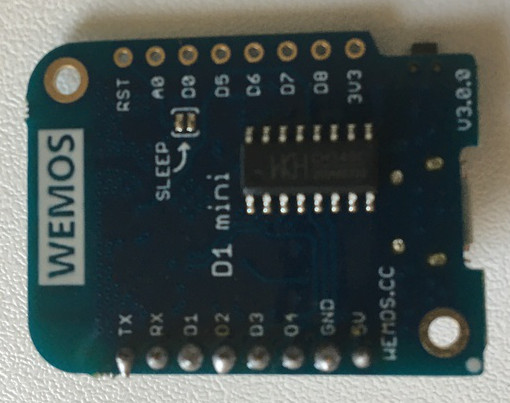
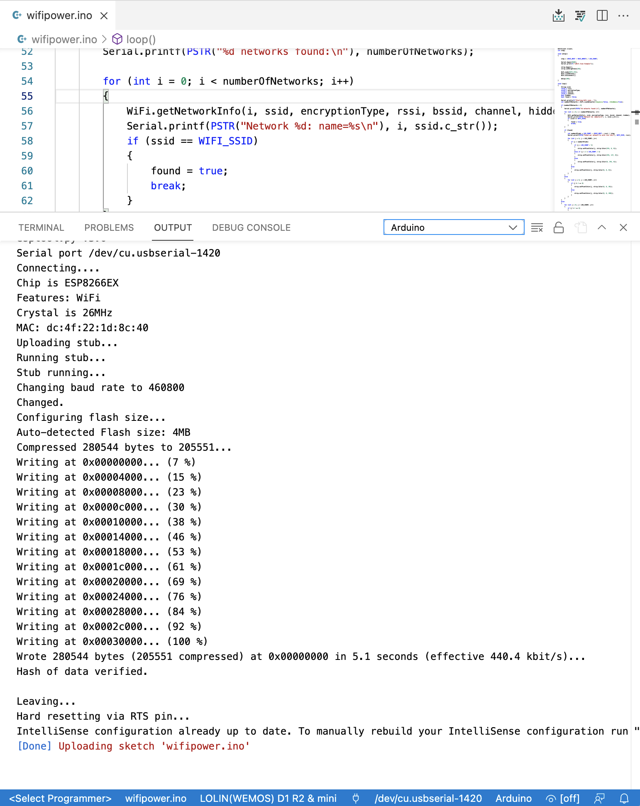
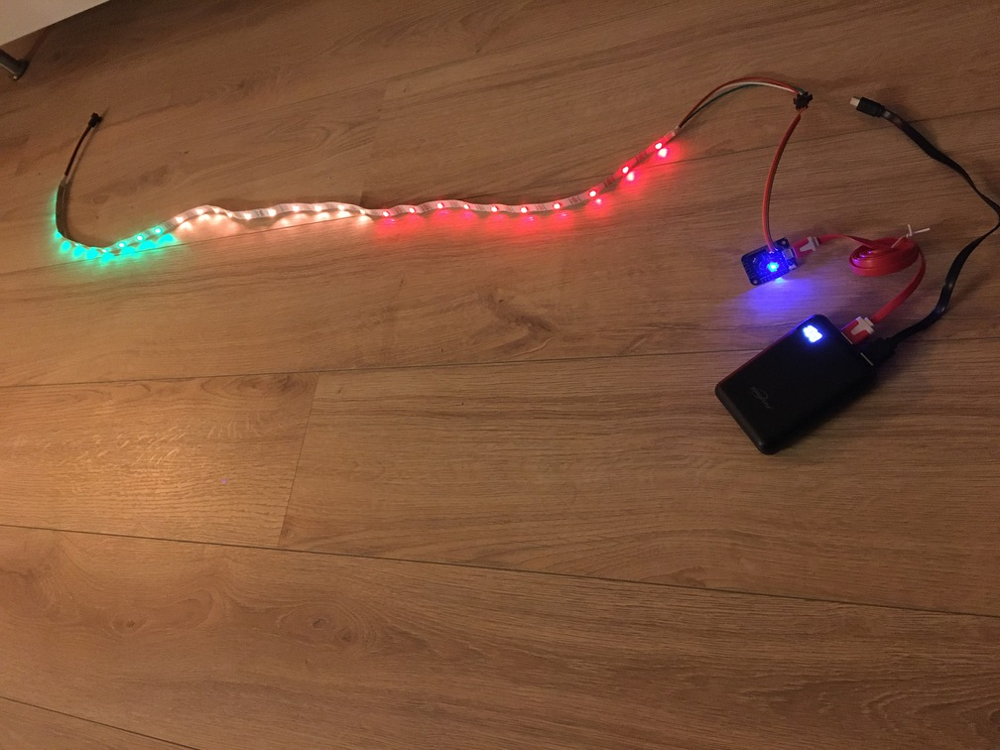

Lors d'une précédente conférence Devoxx France, [Clever-Cloud](https://www.clever-cloud.com/) avait un stand où ils faisaient la démonstration de leur plateforme avec un petit chipset qui contrôlait une bande LED, le tout étant piloté par une websocket communiquant avec le backend hébergé sur Clever-Cloud.
Les infos sur ce projet sont sur Github : https://github.com/CleverCloud/wemos-statsd-example.

Cette bande LED et le chipset étaient distribués en goodies :)

J'ai récemment retrouvé cette bande LED dans une boîte, et j'ai eu envie de jouer avec.
Sur un autre projet, j'ai testé un petit instrument Flower Care qui mesure l'ensoleillement, l'humidité du sol, la température, etc.
Le souci est qu'il ne communique qu'en Bluetooth LE, et il est planté trop loin du Raspberry Pi (qui est dans la maison) pour pouvoir envoyer ses données.

L'idée était donc de faire un relai avec un RPi Zero, et je voulais voir jusqu'où je pouvais aller dans le jardin tout en continuant à capter le signal Wifi de ma box.

Il y a très certainement des applications smartphones qui font ça très bien, mais c'est moins fun que de jouer avec une bande LED :)


## Préparation
### Composants
Les composants utilisés sont :

#### Carte
C'est un Wemos D1 mini, contenant un module ESP8266.
On peut trouver des informations sur le site du fabriquant : https://www.wemos.cc/en/latest/d1/d1_mini.html.

On peut en trouver pour 5 € ou moins sur des sites bien connus (attention au coût de la livraison cependant).

Cette carte inclut un chipset Wifi que l'on utilisera pour détecter le signal.

**Recto**


**Verso**



#### Bande LED
Je n'ai pas trop d'infos sur le modèle, mais on peut voir sur la photo que c'est une bande la marque 3M, modèle *200 MP* ?

Il y 30 LEDs sur cette bande.


#### Batterie
Pour alimenter la carte, il faut un voltage classique de 3.3 V ou via micro-USB (5V).

Quand la carte n'est pas connectée à l'ordinateur, j'utilise une batterie externe classique.


#### Assemblage final
L'assemblage final ressemble à :


### Software
Le code sera en C, et pas très long.

Pour coder et communiquer avec la carte, la solution la plus directe est d'utiliser l'IDE Arduino.

Tout d'abord, il faut configurer la carte dans l'IDE.
La documentation décrit la procédure ici : https://arduino-esp8266.readthedocs.io/en/latest/installing.html.

Essentiellement, il faut :
- aller dans *Préférences* et mettre l'url http://arduino.esp8266.com/stable/package_esp8266com_index.json dans l'URL de gestionnaire de cartes supplémentaires
- puis aller dans *Outils > Type de carte [...] > Gestionnaire de carte* et installer la carte `esp8266`, cela nous donnera accès à la bibliothèque Wifi

J'ai ensuite utilisé ces réglages pour la carte :


Enfin, pour communiquer avec la bande LED, il faut installer la bibliothèque (avec l'outil de gestion des bibliothèques de l'IDE) `Adafruit_NeoPixel`, dont le le projet Github est ici : https://github.com/adafruit/Adafruit_NeoPixel.

> **Note** : Il est également possible d'utiliser VS Code pour coder et communiquer avec la carte 😎 !
> Il faut en pré-requis avoir quand même installé l'Arduino IDE (ou CLI).
> Pour cela j'ai installé les extensions suivantes : 
> - [Arduino](https://marketplace.visualstudio.com/items?itemName=vsciot-vscode.vscode-arduino)
> - [C/C++](https://marketplace.visualstudio.com/items?itemName=ms-vscode.cpptools)
>
> Ouvrir ensuite l'Arduino Board Manager (⌘⇧P) et sélectionner *Arduino: Board Manager*.
> Sélectionner ensuite *LOLIN(WEMOS) D1 R2 & mini*.
> En bas à droite de VS Code, cliquer sur *serial port* pour sélectionner le bon port USB.
>
> Pour vérifier que le code est bon : ⌥⌘R.
>
> Pour envoyer le sketch sur la carte : ⌥⌘U.
>
> 


## Code

Les documentations suivantes ont été utiles :

- Module Wifi : https://arduino-esp8266.readthedocs.io/en/latest/esp8266wifi/readme.html
- Bande LED : https://adafruit.github.io/Adafruit_NeoPixel/html/class_adafruit___neo_pixel.html

De plus, ce site permet de tester *online* le code, sans passer par l'upload sur la carte !!!
https://wokwi.com/arduino/libraries/Adafruit_NeoPixel

Le code en lui même est assez basique :

```C
#include <Adafruit_NeoPixel.h>
#include <ESP8266WiFi.h>

#define LED_PIN D4
#define LED_COUNT 30

#define SCAN_DELAY 500

// See https://fr.wikipedia.org/wiki/Received_Signal_Strength_Indication
#define RSSI_BEST -30
#define RSSI_WORST -90

#define WIFI_SSID "SSID  du réseau à analyser"

Adafruit_NeoPixel strip(LED_COUNT, LED_PIN, NEO_GRB + NEO_KHZ800);
WiFiClient client;
int step;

void setup()
{

    step = (RSSI_BEST - RSSI_WORST) / LED_COUNT;

    Serial.begin(9600);
    Serial.print(F("\nWifi Scan Example"));

    strip.begin();
    strip.setBrightness(20);

    WiFi.mode(WIFI_STA);
    WiFi.scanDelete();
    WiFi.disconnect();

    delay(100);
}

void loop()
{
    String ssid;
    int32_t rssi;
    uint8_t encryptionType;
    uint8_t *bssid;
    int32_t channel;
    bool hidden;
    bool found = false;

    Serial.println(F("Starting WiFi scan..."));
    int numberOfNetworks = WiFi.scanNetworks(/*async=*/false, /*hidden=*/true);

    if (numberOfNetworks > 0)
    {
        Serial.printf(PSTR("%d networks found:\n"), numberOfNetworks);

        for (int i = 0; i < numberOfNetworks; i++)
        {
            WiFi.getNetworkInfo(i, ssid, encryptionType, rssi, bssid, channel, hidden);
            Serial.printf(PSTR("Network %d: name=%s\n"), i, ssid.c_str());
            if (ssid == WIFI_SSID)
            {
                found = true;
                break;
            }
        }
    }

    if (found)
    {
        int numberOfLeds = LED_COUNT - (RSSI_BEST - rssi) / step;
        Serial.printf(PSTR("Found our network %s with rssi %d\n"), WIFI_SSID, rssi);

        for (int j = 0; j < LED_COUNT; j++)
        {
            if (j < numberOfLeds)
            {
                if (j < LED_COUNT / 3)
                {
                    strip.setPixelColor(j, strip.Color(255, 0, 0));
                }
                else if (j < 2 * LED_COUNT / 3)
                {
                    strip.setPixelColor(j, strip.Color(255, 127, 0));
                }
                else
                {
                    strip.setPixelColor(j, strip.Color(0, 255, 0));
                }
            }
            else
            {
                strip.setPixelColor(j, strip.Color(0, 0, 0));
            }
        }
    }
    else
    {
        for (int j = 0; j < LED_COUNT; j++)
        {
            if (j % 2 == 0)
            {
                strip.setPixelColor(j, strip.Color(0, 0, 60));
            }
            else
            {
                strip.setPixelColor(j, strip.Color(0, 0, 200));
            }
        }
    }

    strip.show();

    // Wait a bit before scanning again
    delay(SCAN_DELAY);
}
```

- `LED_COUNT` contient le nombre de LEDs de la bande LED

- Pour le calcul de la force du signal, on a une information RSSI (*Received Signal Strength Indication*) qui n'est qu'une indication et pas une échelle de valeur précise.
  La [page Wikipedia de RSSI](https://fr.wikipedia.org/wiki/Received_Signal_Strength_Indication) précise que pour du Wifi, -30 dBm est élevé, et -90 dBm est à la limite de la réception du signal.

- Dans `WIFI_SSID`, il faut mettre le nom du réseau Wifi que l'on souhaite analyser.

- Le code lance un scan des réseaux Wifi disponibles :
  ```C
  int numberOfNetworks = WiFi.scanNetworks(/*async=*/false, /*hidden=*/true);
  ```

- Puis boucle sur la liste des réseaux jusqu'à trouver celui correspondant au SSID indiqué :
  ```C
  for (int i = 0; i < numberOfNetworks; i++)
  {
      WiFi.getNetworkInfo(i, ssid, encryptionType, rssi, bssid, channel, hidden);
      if (ssid == WIFI_SSID)
      {
        found = true;
        break;
      }
  }
  ```
  Il récupère par la même occasion la force du signal dans la variable `rssi`.

- On calcule le nombre de LEDs qu'il faut allumer en fonction de la force du signal : peu de LEDs si le signal est faible, beaucoup si le signal est fort :
  ```C
  int numberOfLeds = LED_COUNT - (RSSI_BEST - rssi) / step;
  ```
  Le reste sert à mettre des couleurs rouge, orange ou vert.

- Si aucun signal n'est détecté, alors on allume une LED sur deux en bleu intense ou faible.

- Enfin, on attend une demi-seconde et on recommence.


## Démo time !

En étant à côté de la box, le signal est fort !



Un peu plus loin, et avec une casserole sur la tête, le signal est plus faible :


Enfin, sans signal (en fait, j'ai triché, j'ai modifié le SSID pour en mettre un qui n'existe pas 😅) :


## Conclusion
Jouer avec les composants électroniques, c'est fun !
Même si mes cours de C datent de ... pfiou ... c'est vraiment sympa de voir un objet physique réagir à son environnement en fonction de ce que l'on a programmé (même si ici, c'est très *très* modeste).

## Crédits
La photo de l'article est de [cottonbro](https://www.pexels.com/@cottonbro) depuis le site Pexels.

https://www.pexels.com/photo/wood-city-street-banner-5599613/
